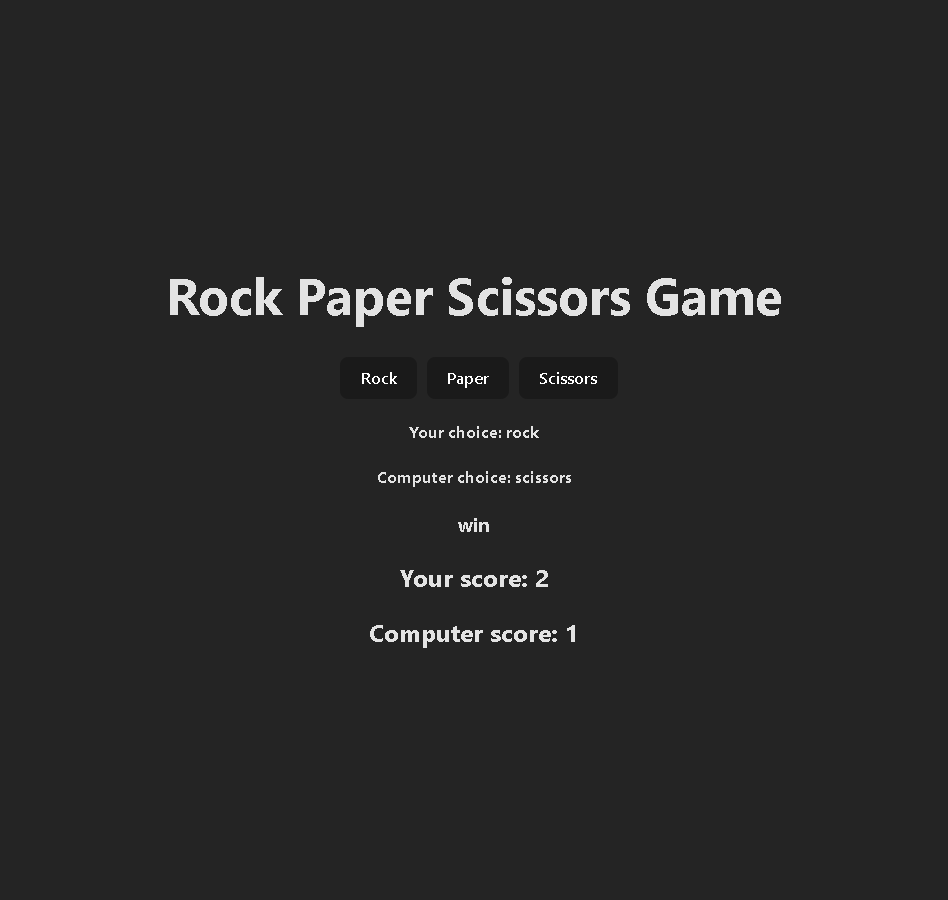

# Rock Paper Scissors Game

A small React practice project that implements the classic Rock–Paper–Scissors game.

## Description

This project was created to practice React fundamentals, especially state management, event handling, and side effects with useEffect.

## Screenshot



## Tech Stack

- React (hooks)
- JavaScript (ES6+)
- Vite

## Features

- Player vs computer game logic
- Random computer choice generation
- State management with useState
- Game logic handled with useEffect
- Score tracking
- Result display after each round

## Usage

```bash
npm install
```

```bash
npm run dev
```

Open in browser:
http://localhost:5173/

## What I Learned

- Using React hooks (useState, useEffect)

- Handling click events and user input

- Implementing conditional game logic

- Managing derived state in React
